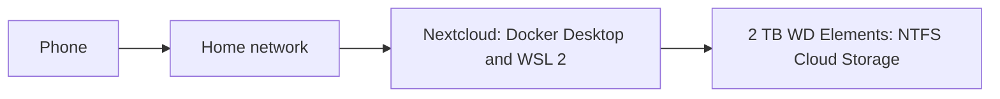

# Self-Hosted 2 TB Nextcloud Server

A locally hosted personal-cloud system that automatically backs up phone photos to a dedicated 2 TB external hard drive.

> **Project status:** Active and being expanded with WSL 2.

## Overview

I built this project to learn how storage, networking, containers, and mobile synchronization work together in a real system.

A Windows laptop hosts Nextcloud through Docker Desktop, while a 2 TB WD Elements external hard drive provides dedicated storage. When my phone returns home and connects to the local network, its photos are backed up through Nextcloud.

## Architecture

## Hardware

| Component | Purpose |
|---|---|
| Windows laptop | Hosts the server environment |
| 2 TB WD Elements drive | Stores the Nextcloud data and photo backups |
| Phone | Automatically uploads photos over the home network |

## Software and Technologies

| Technology | Use in the project |
|---|---|
| Nextcloud | Personal-cloud interface and file synchronization |
| Docker Desktop | Runs Nextcloud as a containerized server application |
| WSL 2 | Provides Linux-container support on Windows |
| Windows | Host operating system |
| NTFS | Filesystem used for the external storage drive |
| Local networking | Connects the phone to the Nextcloud server at home |

## Implementation

1. Connected the 2 TB WD Elements external hard drive to the laptop.
2. Formatted the drive with NTFS and named the volume **Cloud Storage**.
3. Installed Docker Desktop for Windows.
4. Deployed Nextcloud as a containerized server application.
5. Configured the phone to back up photos through Nextcloud on the home network.
6. Began adding WSL 2 to improve Linux-container support.

## What I Learned

- How self-hosted cloud services store and synchronize files
- How Docker packages and runs server applications
- How Windows and Linux work together through WSL 2
- How to configure and manage dedicated external storage
- How devices communicate with a locally hosted service
- Why backups, permissions, networking, and security matter

## Security and Privacy

This repository intentionally excludes private information, including local IP addresses, port details, usernames, passwords, tokens, and personal files.

The service is intended for local-network use. Secure remote access would require safeguards such as HTTPS, strong authentication, firewall configuration, and regular updates.

## Planned Improvements

- Finish the WSL 2 integration
- Document the Docker configuration without exposing secrets
- Add a separate backup for the external drive
- Add health and storage monitoring
- Test recovery from a backup
- Add sanitized screenshots of the Nextcloud dashboard
